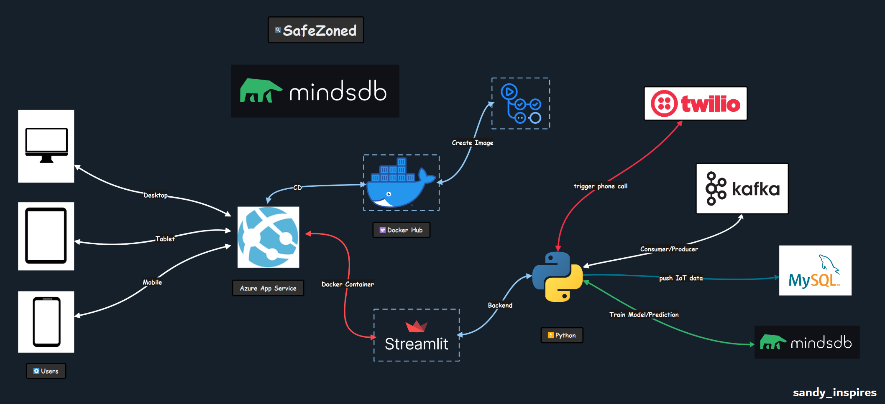

# Child Missing - MindsDB Hackathon 2023

Find if the child is gone missing with Kafka and MindsDB

SafeZoned is an application that is targeted to address this problem once it for all.

GitHub Repo: [Link - Child Missing Kafka MindsDB](https://github.com/Santhoshkumard11/child_missing_kafka_mindsdb)

Demo Link: [Link - Streamlit Web App on Azure](https://mindsdb-child-missing-sandy-inspires.azurewebsites.net/)

Youtube Demo: [Link](https://youtu.be/pvhijlyhdQs)

## Architecture Diagram



## Built with

- Python – General programming language

- Streamlit – Building the consumer dashboard with Python

- Kafka – Queue for processing data from IoT devices

- MySQL – Database to store initial data

- <b> MindsDB </b> – Model training and inferencing

- Docker - containerizing the Streamlit web app

- Azure App Service - Deploying the Docker container

- Twilio - Trigger an emergency call

- MySQL - Store IoT data

### How to run

### Requires Python3.8+

- If you're on Windows, `pip install PyWin`
- Setup `client.properties` file inside kafka before running this commands - Used Confluent Kafka

```bash
python -m pip install -r requirements.txt

#go inside kafka dir and run this

# will simulate five data points and pus to iot_logs Kafka topic
python producer.py -n 5 -t iot_logs

python consumer.py -t iot_logs

python call_consumer.py -t call_initiate
```

## What MindsDB offers

> MindsDB brings machine learning into databases by employing the concept of AI Tables.

MindsDB might have just made all Data Scientist's life easier by bringing ML models to the database level and with cloud.mindsdb.com which is a user-friendly SQL interface to train ML models, connect various data sources, and execute SQL queries. I'll talk more about how to connect your existing MySQL database to MindsDB. I was worried about the speed of the prediction since it has to be real-time or near real-time but to my surprise, it's blisteringly fast less than <b>~600 ms </b> per prediction. (includes network latency - tested on my local machine - <b>8th Gen intel Core - i7-8750H, 16 GIG RAM, GTX 1060 6 GIG VRAM </b>). It's an elegant solution to solve the pain of Data Engineers, where they've to serve AdHoc requests from Data Scientists. But with MindsDB, the data is already in the consumable format and it's available via a SQL interface so it's easy for a Data Scientist to build their models on top of it.


## Deployment

Expand each of the below topics in detail.

<details>

<summary> <b> 1. MindsDB </summary>

#### Connecting to MySQL from MindsDB


> Note: Whitelist all the three IPs in your MySQL instance

> Important: Test Connection before continuing!


Once you click on Save and Continue, all the tables in your MySQL instance should be visible on MindsDB UI for you to use.


#### View Sample Data

```sql
SELECT
    *
FROM
    mysql_kafka.ml_iot_logs
LIMIT
    10
;
```


#### Training

```sql
CREATE MODEL
    mindsdb.child_missing_model
FROM
    mysql_kafka
        (SELECT
            *
        FROM
            ml_iot_logs
        )
PREDICT
    missing
;
```


#### Predict

```sql
SELECT
    missing, missing_explain
FROM
    mindsdb.child_missing_model
WHERE
    latitude = 12.9699
    AND longitude=77.96288
    AND vibration=4.96288
    AND acceleration=77.96288;
```


#### Connect to MindsDB ML model

```
# using sqlalchemy to connect to MindsDBs MySQL server
user = os.environ.get("MINDSDB_USERNAME")
password = os.environ.get("MINDSDB_PASSWORD")
host = "cloud.mindsdb.com"
port = 3306
database = "mindsdb"
logging.info("Attempting to create MindsDB connection")

# connect to MindsDB database - faster than SDKs
conn = create_engine(
    url=f"mysql+pymysql://{user}:{password}@{host}:{port}/{database}").connect()

str_query = """
SELECT
    missing, missing_explain
FROM
    mindsdb.child_missing_model
WHERE
    latitude = 12.9699
    AND longitude=77.96288
    AND vibration=4.96288
    AND acceleration=77.96288
"""

try:
    logging.info("Attempting to execute the query")
    missing, json_missing_explain = conn.execute(text(str_query)).fetchone()
    logging.info("Successfully executed the query")
except Exception as e:
    logging.error(f"Error in send_data_to_mysql - \n{e}")
finally:
    conn.close()
```

</details>

<details>

<summary> <b> 2.Kafka </summary>

#### Dashboard

It gives us an overall view of our producers, consumers, and topic metrics.


We've two topics, iot_logs and call_initiate


##### Sample Data from iot_logs topic


#### Sample Data from call_initiate topic


</details>

<details>

<summary> <b>3. Streamlit - Docker </summary>

#### Dockerfile

```bash
FROM python:3.8.16-slim

RUN mkdir -p /opt/streamlit/child_missing_model

COPY . /opt/streamlit/child_missing_model

WORKDIR /opt/streamlit/child_missing_model

RUN pip install -r requirements.txt

EXPOSE 8501

CMD streamlit run child_missing_model.py
```

.dockerignore

```bash
# exclude all files
*

# include only required files
!child_missing_model.py
!constants.py
!handler.py
!utils.py
!requirements.txt
```

```bash
# build the streamlit image
docker build -t santhoshkdhana/child_missing_mindsdb_hack .
```

```bash
# run the strealit image build in the previous step
docker run -d -p 8501:8501 \
-e MINDSDB_USERNAME="<your_mindsdb_email>" \
-e MINDSDB_PASSWORD="<your_mindsdb_password>" \
-e MYSQL_USERNAME="<MySQL_username>" \
-e MYSQL_HOST="<MySQL_server_URL>" \
-e MYSQL_PASSWORD="<MySQL_server_password>" \
-e TWILIO_ACCOUNT_SID="<Twilio_account_sid>" \
-e TWILIO_AUTH_TOKEN="<Twilio_auth_token>" \
-e TWILIO_TWIML_BIN_URL="<Twilio_twiml_bin_url>" \
--name mindsdb_hack santhoshkdhana/child_missing_mindsdb_hack
```

```bash
# push the image to Docker Hub
docker login
docker push santhoshkdhana/child_missing_mindsdb_hack
```

### UI - Streamlit Web APP

[Click here](https://mindsdb-child-missing-sandy-inspires.azurewebsites.net/) to view the Streamlit web application deployed on Azure.


### Docker Hub

[Click here](https://hub.docker.com/r/santhoshkdhana/child_missing_mindsdb_hack) to view the image in the Docker hub!


```bash
docker pull santhoshkdhana/child_missing_mindsdb_hack
```

</details>

<details>
<summary> <b> 4. Twilio </summary>

#### Twilio TwiML Bin


#### Call Logs


</details>


### Conclusion

This method can help prevent such incidents and enable a safe world for every child out there. Technology is mature enough and not using it to solve critical issues can be bad for society. The cost of IoT devices is cheaper than ever and it’s just a one-time purchase.

### Future of SafeZoned

- Test it with a few real-world users and gather feedback

- Deploy both consumers in the cloud for auto-scaling

- Build a custom dashboard map experience for parents to track their children

- Create a retraining pipeline for the model

### Reference Links

Few of the docs I've used to develop this entire application in just three days, great work MindsDB on docs. Kudos to the team!

[Introduction to Machine Learning - MindsDB](https://docs.mindsdb.com/ml-types)

[MindsDB and SQL Alchemy - MindsDB](https://docs.mindsdb.com/connect/sql-alchemy)

[MindsDB and Kafka - MindsDB](https://docs.mindsdb.com/connect/kafka)

[Feature Engineering in MindsDB - MindsDB](https://docs.mindsdb.com/sql/feature-eng)

[Tutorials by Our Community - MindsDB](https://docs.mindsdb.com/sql/tutorials/classification-community)

[Editor - MindsDB](https://cloud.mindsdb.com/editor)

[MindsDB - GitHub](https://github.com/mindsdb/mindsdb)

[TwiML for Programmable Voice | Twilio](https://www.twilio.com/docs/voice/twiml)

[Join MindsDB Community on Slack | Slack](https://mindsdbcommunity.slack.com/join/shared_invite/zt-1syebtjn9-MLT4dYX2U7NVdorPPDnlRg#/shared-invite/email)

### License

SafeZoned is licensed under the [MIT License](https://github.com/Santhoshkumard11/child_missing_kafka_mindsdb/blob/main/LICENSE)
